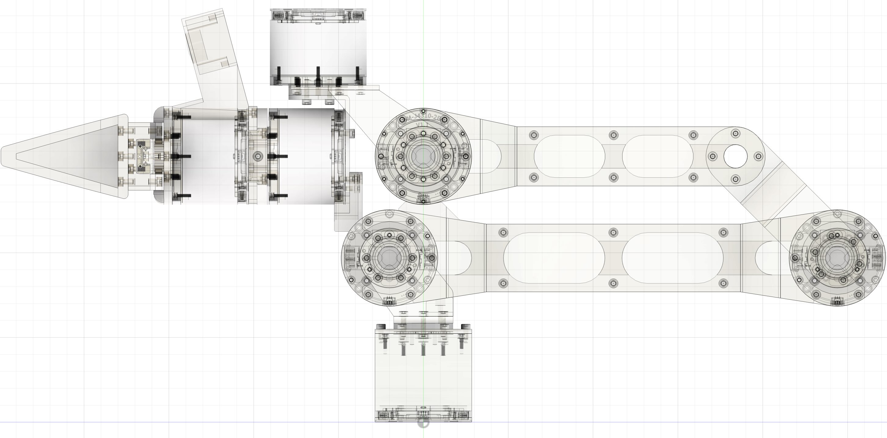
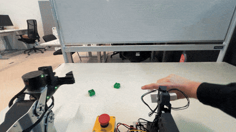
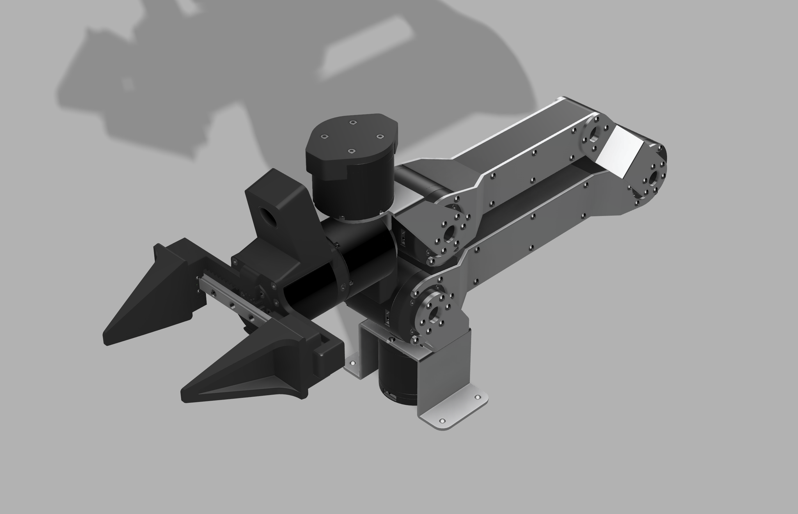
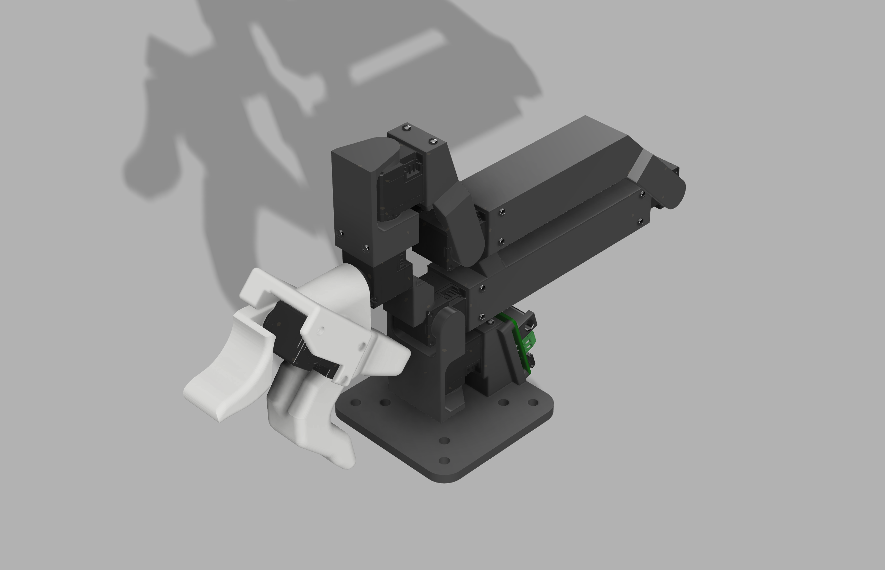

<p align="center">
    
</p>
<p align="center">
    <a href="https://docs.robot-learning.co/">
        </a>
    <a href="https://discord.gg/PTZ3CN5WkJ">
        </a>
    <a href="https://x.com/JannikGrothusen">
        </a>
    <a href="https://www.robot-learning.co/">
        </a>
</p>

<h1 align="center">An Open Source Dev Kit for AI-native Robotics</h1>
<p align="center">by The Robot Learning Company</p>

## Demo

<p align="center">
    
</p>

## CAD

<table align="center">
<tr>
<td width="50%">
<a href="https://github.com/robot-learning-co/trlc-dk1/blob/main/hardware/TRLC-DK1-Follower_v0.2.0.step" target="_blank">
TRLC-DK1 v0.2.0 Follower CAD (Fusion)<br>

</a>
</td>
<td width="50%">
<a href="https://a360.co/481PSQH" target="_blank">
TRLC-DK1 v0.2.0 Leader CAD (Fusion)<br>

</a>
</td>
</tr>
</table>
Copyright 2025 The Robot Learning Company UG (haftungsbeschränkt). All rights reserved.

## Installation

```
conda create -n dk1 python=3.10
conda activate dk1
pip install -e .
```

(This should also install [TRLC's fork of LeRobot](https://github.com/robot-learning-co/lerobot) and use branch `trlc-dk1`)

## Examples

Use [LeRobot's CLI](https://huggingface.co/docs/lerobot/il_robots) to identify your teleop and robot ports:

```
lerobot-find-port
```

<details>
<summary>Teleoperation
</summary>

```bash
lerobot-teleoperate \
    --robot.type=dk1_follower \
    --robot.port=/dev/tty.usbmodem00000000050C1 \
    --robot.joint_velocity_scaling=0.5 \
    --robot.cameras="{ 
        context: {type: opencv, index_or_path: 0, width: 1280, height: 720, fps: 30}, 
        wrist: {type: opencv, index_or_path: 1, width: 1280, height: 720, fps: 30}
      }" \
    --teleop.type=dk1_leader \
    --teleop.port=/dev/tty.usbmodem58FA0824311 \
    --display_data=true
```
</details>

<details>
<summary>Recording
</summary>

```bash
lerobot-record \
    --robot.type=dk1_follower \
    --robot.port=/dev/tty.usbmodem00000000050C1 \
    --robot.joint_velocity_scaling=1.0 \
    --robot.cameras="{ 
        context: {type: opencv, index_or_path: 0, width: 640, height: 360, fps: 30}, 
        wrist: {type: opencv, index_or_path: 1, width: 640, height: 360, fps: 30}
      }" \
    --teleop.type=dk1_leader \
    --teleop.port=/dev/tty.usbmodem58FA0824311 \
    --display_data=true \
    --dataset.repo_id=$USER/my_dataset \
    --dataset.push_to_hub=false \
    --dataset.num_episodes=50 \
    --dataset.episode_time_s=30 \
    --dataset.reset_time_s=15 \
    --dataset.single_task="My task description."
```
```bash
    --resume=true
```
</details>

<details>
<summary>Inference
</summary>

```bash
lerobot-record  \
  --robot.type=dk1_follower \
  --robot.port=/dev/tty.usbmodem00000000050C1 \
  --robot.joint_velocity_scaling=0.5 \
  --robot.cameras="{ 
      context: {type: opencv, index_or_path: 0, width: 640, height: 360, fps: 30}, 
      wrist: {type: opencv, index_or_path: 1, width: 640, height: 360, fps: 30}
    }"
  --display_data=true \
  --dataset.repo_id=$USER/eval_my_model \
  --dataset.single_task="My task description." \
  --dataset.push_to_hub=false \
  --policy.path=outputs/my_model/checkpoints/last/pretrained_model
```
</details>

<details>
<summary>Bimanual Teleoperation
</summary>

```bash
lerobot-teleoperate \
    --robot.type=bi_dk1_follower \
    --robot.right_arm_port=/dev/ttyACM0 \
    --robot.left_arm_port=/dev/ttyACM1 \
    --robot.joint_velocity_scaling=1.0 \
    --robot.cameras="{ 
        context: {type: opencv, index_or_path: 2, width: 640, height: 360, fps: 30}, 
        right_wrist: {type: opencv, index_or_path: 4, width: 640, height: 360, fps: 30},
        left_wrist: {type: opencv, index_or_path: 0, width: 640, height: 360, fps: 30},
      }" \
    --teleop.type=bi_dk1_leader \
    --teleop.right_arm_port=/dev/ttyACM2 \
    --teleop.left_arm_port=/dev/ttyACM3 \
    --display_data=true \
    --display_url=100.88.6.81
```
</details>

<details>
<summary>Bimanual Recording
</summary>

```bash
lerobot-record \
    --robot.type=bi_dk1_follower \
    --robot.right_arm_port=/dev/ttyACM0 \
    --robot.left_arm_port=/dev/ttyACM1 \
    --robot.joint_velocity_scaling=1.0 \
    --robot.cameras="{ 
        context: {type: opencv, index_or_path: 2, width: 640, height: 360, fps: 30}, 
        right_wrist: {type: opencv, index_or_path: 4, width: 640, height: 360, fps: 30},
        left_wrist: {type: opencv, index_or_path: 0, width: 640, height: 360, fps: 30},
      }" \
    --teleop.type=bi_dk1_leader \
    --teleop.right_arm_port=/dev/ttyACM2 \
    --teleop.left_arm_port=/dev/ttyACM3 \
    --dataset.repo_id=$USER/disassemble_lego \
    --dataset.push_to_hub=false \
    --dataset.num_episodes=40 \
    --dataset.episode_time_s=180 \
    --dataset.reset_time_s=120 \
    --dataset.single_task="Disassemble the Lego and sort it." \
    --dataset.reset_time_s=120 \
    --resume=true
```
</details>

## URDF

<p align="center">
    
</p>

A high-quality URDF file was developed by community member Andreas Köpf:
[andreaskoepf/trlc-dk1-follower-urdf](https://github.com/andreaskoepf/trlc-dk1-follower-urdf)

## Acknowledgements

- [GELLO](https://wuphilipp.github.io/gello_site/) by Philipp Wu et al.
- [Low-Cost Robot Arm](https://github.com/AlexanderKoch-Koch/low_cost_robot) by Alexander Koch
- [LeRobot](https://github.com/huggingface/lerobot) by HuggingFace, Inc.
- [SO-100](https://github.com/TheRobotStudio/SO-ARM100) by TheRobotStudio
- [OpenArm](https://openarm.dev/) by Enactic, Inc.
